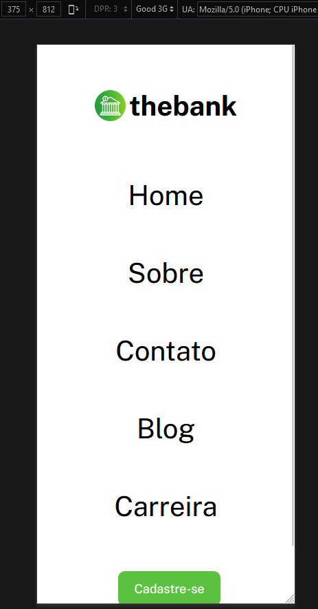
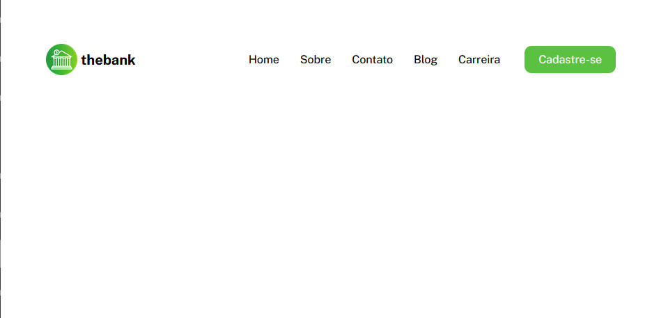

# Projeto The Bank Mobile First Menu com flexbox
Um projeto para treinar Git Bash, HTML e CSS. Principalmente, com um menu flexbox. Ao criar o menu assim, facilita a responsavidade do projeto.

Diferente do outro projeto [The Bank - menu com flexbox](https://github.com/cezarviana/menu-com-flexbox), esse foi concebido com ênfase no mobile first. Ou seja, primeiro é desenvolvido o produto para aparelhos mobile. Depois, faz-se a responsividade para utilização em computadores.

Isso é feito, pois, a maior parte dos acessos a sites na internet ocorrem via aparelhos mobile. Logo, o mobile first prioriza esses usuários, que são a grande maioria.

## Descrição da tarefa
O principal desafio é criar um visual parecido com o disponibilizado no Figma. Contudo, iniciando primeiro o desenvolvimento voltado para o mobile. A tarefa ajuda a aprimorar as habilidades de posicionamento de elementos utilizando flexbox, assim como a implementação da resposividade.

### Font family para ser usada no projeto:

- Family: [Public Sans](https://fonts.google.com/specimen/Public+Sans?query=public)
- Weights: 400, 800

### Cores
***
--hover-color: #5BC241;  
***

### Imagens do Design a ser seguido
[Figma](https://www.figma.com/file/DYk9DZr6urB9MZ4iNt1a61/Desafio-HTML-%2B-CSS?type=design&node-id=0-1&mode=design&t=PtPcFiAG49VFSOON-0)

## Imagens do Design criado

  

## Tecnologias utilizadas
- HTML
- CSS
- Git Bash

### Como utilizar

1 - Clone o projeto
***
git clone <https://github.com/cezarviana/thebank-mobile-first-menu-com-flexbox.git>
***

